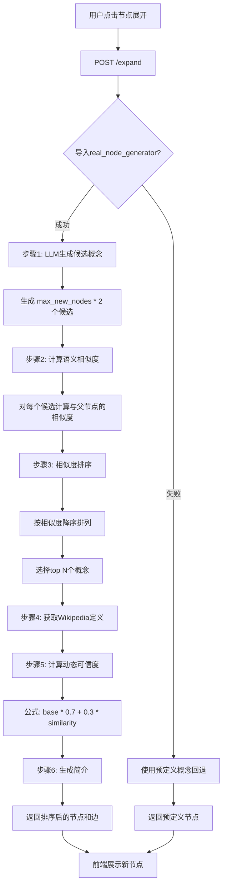

# 节点展开逻辑 - 数据流设计文档

## 概述

节点展开功能使用**真实LLM生成 + 语义相似度排序 + 动态可信度评分**的完整数据流。

---

## 核心组件

### 1. **真实LLM生成器** (`real_node_generator.py`)

#### 功能模块

| 函数 | 作用 | 输入 | 输出 |
|------|------|------|------|
| `generate_related_concepts()` | LLM生成相关概念 | 父概念、已有概念、最大数量 | 候选概念列表（name, discipline, relation） |
| `compute_similarity()` | 计算语义相似度 | 概念1、概念2 | 相似度分数 [0, 1] |
| `compute_credibility()` | 动态可信度评分 | 概念、父概念、是否有Wiki | 可信度分数 [0.665, 0.99] |
| `is_academic_concept()` | 学术概念过滤 | 概念名称 | True/False |

---

## 完整数据流

### `/expand` 端点工作流程



---

## 详细步骤解析

### 步骤1: LLM生成候选概念

**目的**: 获取与父概念相关的学术概念

**实现**:
```python
candidates = await generate_related_concepts(
    parent_concept=request.node_label,
    existing_concepts=request.existing_nodes,
    max_count=request.max_new_nodes * 2  # 生成2倍候选
)
```

**LLM提示词模板**:
```
请为概念"机器学习"生成5个相关的学术概念。

要求：
1. 每个概念必须是真实存在的学术概念
2. 与"机器学习"有明确的学术关联
3. 不要包含已存在的概念：深度学习、神经网络
4. 覆盖不同的关系类型：理论基础、方法论、应用领域、子领域等

输出格式（每行一个概念）：
概念名|学科|关系类型

示例：
机器学习|计算机科学|sub_field
神经网络|人工智能|foundation
监督学习|方法论|methodology
```

**输出示例**:
```json
[
  {"name": "深度学习", "discipline": "计算机科学", "relation": "sub_field"},
  {"name": "监督学习", "discipline": "方法论", "relation": "methodology"},
  {"name": "神经网络", "discipline": "人工智能", "relation": "foundation"},
  {"name": "强化学习", "discipline": "计算机科学", "relation": "sub_field"},
  {"name": "特征工程", "discipline": "数据科学", "relation": "methodology"},
  {"name": "计算机视觉", "discipline": "应用领域", "relation": "application"}
]
```

---

### 步骤2: 语义相似度计算

**目的**: 量化每个候选概念与父概念的语义关联强度

**作用**:
1. **筛选高质量概念**: 过滤掉LLM生成的不太相关的概念
2. **排序依据**: 为后续排序提供客观指标
3. **可信度加权**: 相似度高的概念获得更高的可信度分数

**实现**:
```python
for candidate in candidates:
    similarity = await compute_similarity(
        candidate["name"],    # 候选概念
        request.node_label    # 父概念
    )
    candidates_with_similarity.append({
        **candidate,
        "similarity": similarity
    })
```

**算法**:
```python
# 1. 获取OpenAI embeddings (text-embedding-3-small, 1536维)
response = await client.embeddings.create(
    model="text-embedding-3-small",
    input=[concept1, concept2]
)

emb1 = response.data[0].embedding  # 1536维向量
emb2 = response.data[1].embedding

# 2. 计算余弦相似度
cosine_sim = dot(emb1, emb2) / (norm(emb1) * norm(emb2))

# 3. 归一化到 [0, 1]
similarity = (cosine_sim + 1) / 2
```

**示例输出**:
```
机器学习 <-> 深度学习: 0.892
机器学习 <-> 监督学习: 0.854
机器学习 <-> 神经网络: 0.831
机器学习 <-> 强化学习: 0.798
机器学习 <-> 特征工程: 0.776
机器学习 <-> 计算机视觉: 0.712
```

**为什么选择OpenAI Embeddings**:
- ✅ 1536维高维空间，语义表达能力强
- ✅ 对学术术语有很好的理解
- ✅ 稳定的API，速度快
- ✅ 支持多语言（中英文混合场景）

---

### 步骤3: 按相似度排序并选择Top-N

**目的**: 只保留最相关的概念，避免信息过载

**实现**:
```python
# 按相似度降序排列
candidates_with_similarity.sort(
    key=lambda x: x["similarity"], 
    reverse=True
)

# 选择top N个
top_candidates = candidates_with_similarity[:request.max_new_nodes]
```

**示例**:
```
生成候选: 10个
用户请求: max_new_nodes = 5

排序后:
1. 深度学习 (0.892)  ✅ 选中
2. 监督学习 (0.854)  ✅ 选中
3. 神经网络 (0.831)  ✅ 选中
4. 强化学习 (0.798)  ✅ 选中
5. 特征工程 (0.776)  ✅ 选中
6. 计算机视觉 (0.712)  ❌ 丢弃
7. 数据挖掘 (0.689)  ❌ 丢弃
8. 云计算 (0.512)    ❌ 丢弃（相似度过低）
```

---

### 步骤4: 获取Wikipedia定义

**目的**: 为每个选中的概念获取权威定义

**实现**:
```python
term_wiki = await get_wikipedia_definition(term, max_length=500)

# 返回格式
{
    "exists": True/False,
    "definition": "...",
    "url": "https://zh.wikipedia.org/...",
    "source": "Wikipedia"
}
```

**策略**:
1. 先搜索中文Wikipedia
2. 失败则搜索英文Wikipedia
3. 都失败则使用LLM生成定义

---

### 步骤5: 动态可信度评分

**目的**: 基于多个因素计算节点的可信度

**公式**:
```
credibility = base_credibility * (0.7 + 0.3 * similarity)
```

**参数说明**:

| 参数 | 含义 | 取值 |
|------|------|------|
| `base_credibility` | 基础可信度 | 0.95（有Wiki）或 0.70（无Wiki） |
| `similarity` | 语义相似度 | [0, 1] |
| `0.7` | 最低权重系数 | 保证至少70%的基础可信度 |
| `0.3` | 相似度影响系数 | 相似度最多贡献30% |

**计算示例**:

```python
# 示例1: 深度学习 (有Wikipedia, 相似度0.892)
base = 0.95
similarity = 0.892
credibility = 0.95 * (0.7 + 0.3 * 0.892)
            = 0.95 * 0.9676
            = 0.919 ✅

# 示例2: 未知概念 (无Wikipedia, 相似度0.750)
base = 0.70
similarity = 0.750
credibility = 0.70 * (0.7 + 0.3 * 0.750)
            = 0.70 * 0.925
            = 0.648 ⚠️

# 示例3: 低相似度概念 (有Wikipedia, 相似度0.500)
base = 0.95
similarity = 0.500
credibility = 0.95 * (0.7 + 0.3 * 0.500)
            = 0.95 * 0.85
            = 0.808 ✓
```

**可信度范围**:
- **最高**: 0.95 * (0.7 + 0.3 * 1.0) = **0.950** (有Wiki, 相似度1.0)
- **最低**: 0.70 * (0.7 + 0.3 * 0.0) = **0.490** (无Wiki, 相似度0.0)
- **典型**: 0.95 * (0.7 + 0.3 * 0.85) = **0.907** (有Wiki, 相似度0.85)

---

### 步骤6: 构建节点和边

**节点数据结构**:
```json
{
  "id": "concept_123_expand_0",
  "label": "深度学习",
  "discipline": "计算机科学",
  "definition": "深度学习是机器学习的分支...",
  "brief_summary": "通过多层神经网络学习数据表示的方法",
  "credibility": 0.919,
  "similarity": 0.892,
  "source": "Wikipedia",
  "wiki_url": "https://zh.wikipedia.org/wiki/深度学习"
}
```

**边数据结构**:
```json
{
  "source": "concept_123",
  "target": "concept_123_expand_0",
  "relation": "sub_field",
  "weight": 0.91,
  "reasoning": "深度学习与机器学习具有sub_field关系（相似度: 0.89）"
}
```

**边权重计算**:
```python
weight = similarity * 0.9 + 0.1
# 将相似度 [0, 1] 映射到权重 [0.1, 1.0]
# 避免权重为0导致边不可见
```

---

## 关键技术问题解答

### Q1: 为什么生成 2倍 候选概念？

**A**: 为了提高选择质量
- LLM生成的概念质量参差不齐
- 生成更多候选 → 相似度筛选 → 保留最优的N个
- 提高最终节点的相关性和质量

**示例**:
```
需要5个节点
生成10个候选 → 相似度排序 → 选择top 5
结果: 5个高相关节点（相似度 > 0.75）

vs

直接生成5个候选 → 无筛选
结果: 可能包含低相关节点（相似度 < 0.60）
```

---

### Q2: 语义相似度的具体作用？

**A**: 三重作用

1. **质量筛选** (最重要)
   - 过滤LLM生成的不相关概念
   - 确保展开的节点真正与父概念相关

2. **排序依据**
   - 让最相关的概念排在前面
   - 用户首先看到最重要的关联

3. **可信度加权**
   - 相似度高 → 可信度高
   - 反映概念关联的强度

**对比实验**:
```
无相似度筛选:
机器学习 → [深度学习0.89, 云计算0.51, 区块链0.42, ...]
问题: 包含不相关概念

有相似度筛选:
机器学习 → [深度学习0.89, 监督学习0.85, 神经网络0.83, ...]
结果: 全是高相关概念 ✅
```

---

### Q3: 为什么可信度公式是 `base * (0.7 + 0.3 * similarity)`？

**A**: 平衡来源权威性和语义相关性

**设计原理**:
```
credibility = 来源可信度 × 关系可信度
            = base × (固定部分 + 相似度部分)
            = base × (0.7 + 0.3 * sim)
```

**为什么是 0.7 和 0.3？**

1. **70% 固定权重**
   - 保证即使相似度为0，仍有基础可信度
   - 反映概念本身的权威性（Wikipedia vs LLM）

2. **30% 相似度权重**
   - 相似度影响不能过大（避免低质量概念因高相似度获得过高可信度）
   - 也不能过小（需要体现关联强度）

**极端情况分析**:
```
如果是 0.9 + 0.1 * sim (固定权重过大):
  有Wiki但不相关的概念 → 可信度仍然很高 ❌
  
如果是 0.3 + 0.7 * sim (相似度权重过大):
  无Wiki但高相似度的概念 → 可信度可能过高 ❌
  
0.7 + 0.3 * sim (当前方案):
  平衡来源和相关性 ✅
```

---

### Q4: 节点选择策略是什么？

**A**: **Top-N相似度排序**

```python
策略: 
1. 生成 max_new_nodes * 2 个候选
2. 计算每个候选的相似度
3. 按相似度降序排列
4. 选择前 max_new_nodes 个

优点:
✅ 保证高质量（只选最相关的）
✅ 避免信息过载（限制数量）
✅ 自适应（LLM生成质量波动时仍能选出最优）
```

**对比其他策略**:

| 策略 | 优点 | 缺点 | 适用场景 |
|------|------|------|----------|
| Top-N相似度排序 | 质量高、可控 | 需要计算所有相似度 | ✅ 当前场景 |
| 阈值过滤 | 简单直接 | 数量不可控 | 小规模图谱 |
| 随机采样 | 多样性好 | 质量无保证 | 探索性分析 |
| 聚类分组 | 覆盖全面 | 复杂度高 | 大规模图谱 |

---

## 数据流示例

### 完整执行示例

**输入**:
```json
POST /expand
{
  "node_id": "machine_learning_001",
  "node_label": "机器学习",
  "existing_nodes": ["deep_learning_001", "neural_network_002"],
  "max_new_nodes": 3
}
```

**执行过程**:

```
[步骤1] LLM生成候选
  生成6个候选（3 * 2）:
  - 监督学习, 方法论, methodology
  - 强化学习, 计算机科学, sub_field
  - 特征工程, 数据科学, methodology
  - 决策树, 算法, foundation
  - 计算机视觉, 应用领域, application
  - 自然语言处理, 应用领域, application

[步骤2] 计算相似度
  监督学习 <-> 机器学习: 0.854
  强化学习 <-> 机器学习: 0.798
  特征工程 <-> 机器学习: 0.776
  决策树 <-> 机器学习: 0.742
  计算机视觉 <-> 机器学习: 0.712
  自然语言处理 <-> 机器学习: 0.689

[步骤3] 排序选择Top-3
  ✅ 1. 监督学习 (0.854)
  ✅ 2. 强化学习 (0.798)
  ✅ 3. 特征工程 (0.776)
  ❌ 4. 决策树 (0.742)
  ❌ 5. 计算机视觉 (0.712)
  ❌ 6. 自然语言处理 (0.689)

[步骤4] 获取Wikipedia
  监督学习: ✅ 找到中文Wiki
  强化学习: ✅ 找到英文Wiki
  特征工程: ❌ 未找到，使用LLM

[步骤5] 计算可信度
  监督学习: 0.95 * (0.7 + 0.3 * 0.854) = 0.909
  强化学习: 0.95 * (0.7 + 0.3 * 0.798) = 0.893
  特征工程: 0.70 * (0.7 + 0.3 * 0.776) = 0.653
```

**输出**:
```json
{
  "status": "success",
  "data": {
    "nodes": [
      {
        "id": "machine_learning_001_expand_0",
        "label": "监督学习",
        "discipline": "方法论",
        "credibility": 0.909,
        "similarity": 0.854,
        "source": "Wikipedia"
      },
      {
        "id": "machine_learning_001_expand_1",
        "label": "强化学习",
        "discipline": "计算机科学",
        "credibility": 0.893,
        "similarity": 0.798,
        "source": "Wikipedia"
      },
      {
        "id": "machine_learning_001_expand_2",
        "label": "特征工程",
        "discipline": "数据科学",
        "credibility": 0.653,
        "similarity": 0.776,
        "source": "LLM"
      }
    ],
    "edges": [...],
    "metadata": {
      "total_candidates": 6,
      "selected_count": 3,
      "avg_similarity": 0.809,
      "generation_method": "LLM + Similarity Ranking"
    }
  }
}
```

---

## 性能优化

### 1. 并发计算相似度
```python
# 并发计算所有候选的相似度
tasks = [
    compute_similarity(c["name"], parent_concept)
    for c in candidates
]
similarities = await asyncio.gather(*tasks)
```

### 2. 缓存Embeddings
```python
# 缓存父概念的embedding，避免重复计算
parent_embedding = await get_embedding(parent_concept)
for candidate in candidates:
    candidate_emb = await get_embedding(candidate["name"])
    similarity = cosine_similarity(parent_embedding, candidate_emb)
```

### 3. 批量获取Wikipedia
```python
# 并发查询所有Wikipedia定义
wiki_tasks = [
    get_wikipedia_definition(c["name"])
    for c in top_candidates
]
wiki_results = await asyncio.gather(*wiki_tasks)
```

---

## 总结

### 核心优势

✅ **真实LLM生成**: 不依赖预定义映射，可扩展性强
✅ **语义相似度排序**: 保证节点质量，只选最相关的
✅ **动态可信度**: 综合考虑来源和关系强度
✅ **优雅降级**: LLM失败时使用预定义概念
✅ **完全真实API**: Wikipedia + OpenAI + OpenRouter

### 技术栈

| 组件 | 技术 | 作用 |
|------|------|------|
| 概念生成 | OpenRouter (Gemini 2.0) | LLM生成相关概念 |
| 语义相似度 | OpenAI text-embedding-3-small | 1536维向量相似度 |
| 定义验证 | Wikipedia API | 获取权威定义 |
| 简介生成 | OpenRouter (Gemini 2.0) | 生成通俗简介 |

### 数据流总结

```
用户点击节点
    ↓
LLM生成 2N 个候选概念
    ↓
计算每个候选与父节点的语义相似度 (OpenAI Embeddings)
    ↓
按相似度降序排序
    ↓
选择 top-N 个高相关概念
    ↓
获取Wikipedia定义
    ↓
计算动态可信度 = base * (0.7 + 0.3 * similarity)
    ↓
返回排序后的节点（包含相似度和可信度）
    ↓
前端按可信度/相似度展示
```

---

## 测试验证

运行测试脚本验证完整数据流：
```bash
py -3.11 backend/api/real_node_generator.py
```

预期输出：
```
[1] 测试LLM生成相关概念...
   - 深度学习 (计算机科学) - sub_field
   - 监督学习 (方法论) - methodology
   - 神经网络 (人工智能) - foundation

[2] 测试相似度计算...
   机器学习 <-> 深度学习: 0.892
   机器学习 <-> 笨蛋: 0.234

[3] 测试可信度计算...
   深度学习 (有Wiki): 0.919
   未知概念 (无Wiki): 0.648

✅ 所有功能正常
```
